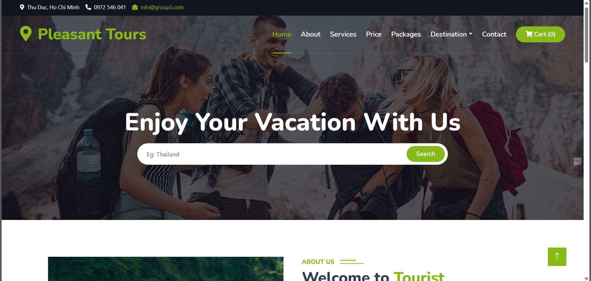

</a>
 

</a>

Recognizing the digital era's growth, we've launched a user-friendly website, offering easy access to comprehensive tour information. Explore our predefined itineraries and choose your perfect getaway from the comfort of your home. Welcome to a seamless online experience with Pleasant Tours.

###### 
[Explore the sourse » ](https://github.com/Nguyenthanhgit/pleasant-tour-project-group-5) [Explore the documents » ](https://github.com/Nguyenthanhgit/pleasant-tour-project-group-5/tree/master/Documents)

 

 <a  href="https://pleasant-tour-project-group-5.vercel.app/" target="_blank">View Demo</a> . <a  href="https://youtu.be/" target="_blank">Video</a>

#### 
Built With

###### 
Below is the languages/libraries we used for this project:

###### 
![HTML]&nbsp;![CSS3] &nbsp;![JS]&nbsp;![BOOSTRAP]&nbsp;![REACT]

### Features  

<ol>
<li>
The Home Page will provide a comprehensive description of all information and services related to tourism, enabling users to quickly grasp essential details. This will be the place where you can find all the information about destinations, travel itineraries, and various services swiftly and conveniently.
 
</li>
<li>
The website must provide information like “About us”, “Services”,
“Packages”, "Pages", "Destination", “Booking”, “Contact”, “Travel Guildes”,
”Testimonial”, 404 Page”.
  
</li>
<li>
 Each section must provide brief information.
 
</li>
<li>
Also each link must be properly hyperlinked, images must be used wherever
necessary.
 
</li>
<li>
“Contact Us” page which will have the Address of the Company which is as follows and the mail address which when clicked will invoke the local mail client from where they can send an email. Address of the Company should be displayed using GeoLocation API (eg. GoogleMaps).

 
</li>
<li>
When a user selects any product type, a list of products for that product type will be displayed.
 
</li>
<li>
Itinerary of individual tour products should be displayed on the Web Page along with the title but detailed itinerary should be stored in Individual Word documents which can be downloaded or viewed by the User who wishes to see the same.
 
</li>
<li>
Price List for all tours should be available for download.
 
</li>
</ol>

## Members of group

### Leader : Lê Hoàng Duy `Student1528054`

#### Members:

Nguyễn Xuân Thành `Student1528057`  
Lê Hoàng Duy `Student1528054`  
Đào Anh Sơn `Student1518647`  
Mai Thanh Phương`Student1526159`  

[HTML]: https://img.shields.io/badge/HTML5-E34F26?style=for-the-badge&logo=html5&logoColor=white
[CSS3]: https://img.shields.io/badge/CSS3-1572B6?style=for-the-badge&logo=css3&logoColor=white
[JS]: https://img.shields.io/badge/JavaScript-F7DF1E?style=for-the-badge&logo=javascript&logoColor=black
[BOOSTRAP]: https://img.shields.io/badge/Bootstrap-563D7C?style=for-the-badge&logo=bootstrap&logoColor=white
[REACT]: https://img.shields.io/badge/React-20232A?style=for-the-badge&logo=react&logoColor=61DAFB
